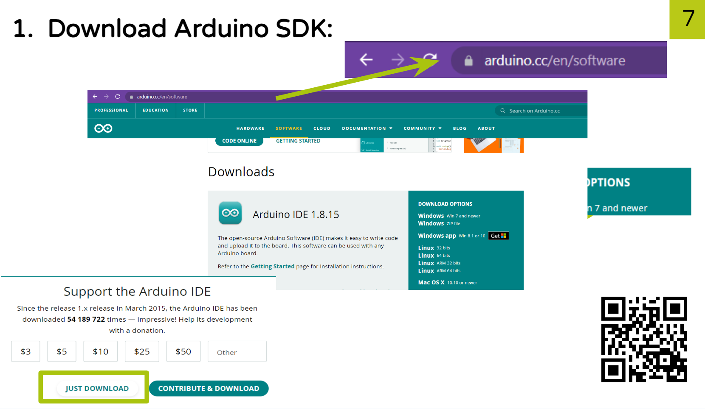

# GripperQS

1. If you don't have the Arduino IDE installed yet, install it using the next instructions.

2. To control the dynamixel, download the folder DynamixelSerial from this repository and install it in the Arduino IDE.

  

# Mediapipe

pip install mediapipe

